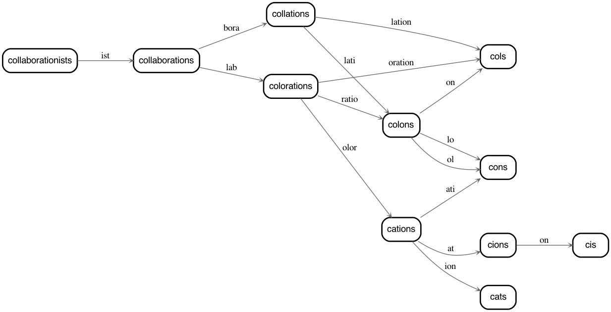

[](https://recurse-words.readthedocs.io/en/latest/?badge=latest)

# recurse-words
find words that have other words in them that when you remove the inner word what's left is still a word



and do other stuff too like evaluate the modular phonetic structure of English like

```python
from recurse_words import Graph_Recurser, Graph
recurser = Graph_Recurser('phonetic_common')
recurser.recurse_all_words(
    min_include_word = 3,
    min_test_word    = 2,
    min_clipped_word = 2
)
Graph(recurser).render_graph('img').save('/some/path.png')
```


# [docs are here!!!](https://recurse-words.readthedocs.io/en/latest/)

main docs at https://recurse-words.readthedocs.io/
```
   ______________________________
 / \                             \.
|   |      p l e s               |.
 \_ |        t a k e             |.
    |          n o t e           |.
    |     -------------------    |.
    |                            |.
    |     this software is       |.
    |     developed expressly    |.
    |     for the purpose of     |.
    |     "funzies"              |.
    |                            |.
    |     i make no promises     |.
    |     that it works          |.
    |     or is good             |.
    |                            |.
    |   _________________________|___
    |  /                            /.
    \_/dc__________________________/.
```

# installation

From pypi:

```
pip install recurse-words
```

From github:

```
git clone https://github.com/sneakers-the-rat/recurse-words
pip install ./recurse-words
# or
poetry install ./recurse-words
```

# usage

Point the recurser at a file that has a list of words,
for example [this one](https://raw.githubusercontent.com/dwyl/english-words/master/words_alpha.txt), 
and let 'er rip

```python
from recurse_words import Recurser

recurser = Recurser('path/to/some/words.txt')
recurser.recurse_all_words()
recurser.save('word_trees.pck')

# see word trees by a few metrics
# max tree depth
recurser.by_depth
# total number of leaves
recurser.by_leaves
# total number of edges
recurser.by_density
```

Draw network graphs!

```python
recurser.draw_graph('some_word', '/output/directory')
```

Auto-download different corpuses!

```python
recurser = Recurser(corpus='english')
recurser = Recurser(corpus='phonetic')
```

